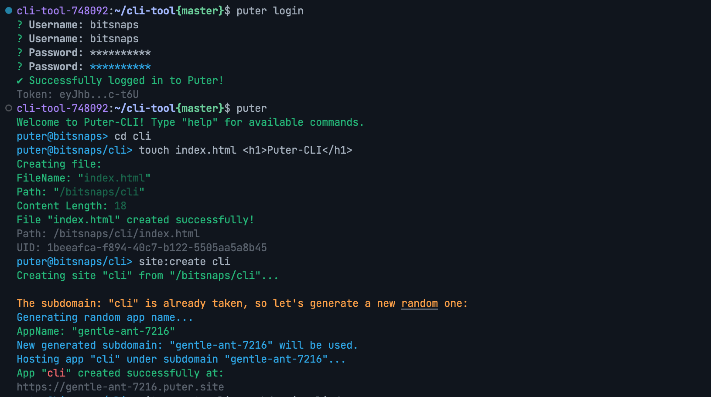

# Puter-CLI

<p align="center">
    
    <a href="https://codecov.io/github/HeyPuter/puter-cli" > 
       
    </a>
    
    <a href="https://opensource.org/licenses/MIT" > 
      
    </a>
    <a href="https://www.npmjs.com/package/puter-cli"></a>
</p>


The **Puter CLI** is a command-line interface tool designed to interact with the **Puter Cloud Platform**. If you don't have an account you can [Signup](https://puter.com/?r=N5Y0ZYTF) from here for free. This cli tool allows users to manage files, directories, applications, and other resources directly from the terminal. This tool is ideal for developers and power users who prefer working with command-line utilities.




---

## Features

- **File Management**: Upload, download, list, and manage files and directories.
- **Authentication**: Log in and log out of your Puter account.
- **User Information**: Retrieve user details, such as username, email, and account status.
- **Disk Usage**: Check disk usage and storage limits.
- **Application Management**: Create, delete, and list applications hosted on Puter.
- **Static Site Hosting**: Deploy static websites from directories.
- **Interactive Shell**: Use an interactive shell for seamless command execution.
- **Cross-Platform**: Works on Windows, macOS, and Linux.

---

## Installation

### Prerequisites
- Node.js (v18 or higher)
- npm (v7 or higher)

Run the following command to install puter-cli globally in your system:
```bash
npm install -g puter-cli
```

Execute the following command to check the installation process:
```bash
puter --version
```

## Usage

### Commands

#### Initialize a project
- **Create a new project**: Initialize a new project
```bash
  puter init
```
Then just follow the prompts, this command doesn't require you to log in.

#### Authentication
- **Login**: Log in to your Puter account.
```bash
  puter login [--save]
```
P.S. You can add `--save` to save your authentication `token` to `.env` file as `PUTER_API_KEY` variable.

- **Logout**: Log out of your Puter account.
```bash
  puter logout
```

#### File Management

We've adopted the most basic popular Linux system command line for daily file manipulation with some extra features, not out of the box though, we want to keep it simple.

- **List Files**: List files and directories.
```bash
  puter> ls [dir]
```
- **Change Directory**: Navigate to a directory:
```bash
  puter> cd [dir]
```
It works with wildcards as you would expect in any OS for basic navigation with insensitive case: `cd ..`, `cd ../myapp`...etc.

- **Create Directory**: Create a new directory.
```bash
  puter> mkdir <dir>
```

- **Create file**: Create a new file in the current directory.
```bash
  puter> touch <file>
```

- **Copy Files**: Copy files or directories.
```bash
  puter> cp <src> <dest>
```

- **Move Files**: Move or rename files or directories.
```bash
  puter> mv <src> <dest>
```

- **Delete Files/Directories**: Move files or directories to the trash.
```bash
  puter> rm [-f] <file>
```

- **Empty Trash**: Empty the system's trash.
```bash
  puter> clean
```
##### Extra commands:

Think of it as `git [push|pull]` commands, they're basically simplified equivalents.

- **Push Files**: Copy files from host machine to the remote cloud instance.
```bash
  puter> push <host_src>
```
- **Pull Files**: Copy files from remote cloud instance to the host machine.
```bash
  puter> pull <remote_src>
```
P.S. These commands consider the current directory as the base path for every operation, basic wildcards are supported: e.g. `push myapp/*.html`.

- **Synchronize Files**: Bidirectional synchronization between local and remote directories.
```bash
  puter> update <local_directory> <remote_directory> [--delete] [-r]
```
P.S. The `--delete` flag removes files in the remote directory that don't exist locally. The `-r` flag enables recursive synchronization of subdirectories.

- **Edit a file**: Edit remote text files using your preferred local text editor.
```bash
  puter> edit <file>
```
P.S. This command will download the remote file to your local machine, open it in your default editor, and then upload the changes back to the remote instance. It uses `vim` by default, but you can change it by setting the `EDITOR` environment variable.


#### User Information

- **Get User Info**: Display user information.
```bash
  puter> whoami
```

#### Disk Usage
- **Check Disk Usage**: Display disk usage information.
```bash
  puter> df
```
- **Get Usage Info**: Fetch usage information for services.
```bash
  puter> usage
```

#### Application Management

The **Application** are sepcial type of hosted web app, they're served from the special directory at: `<USERNAME>/AppData/<UUID>...`, more details at **app:create** in the section below.

- **List Applications**: List all applications.
```bash
  puter> apps [period]
```
P.S. Please check the help command `help apps` for more details about any argument.

- **Create Application**: Create a new application.
```bash
  puter> app:create <name> [<directory>] [--description="My App Description"] [--url=<url>]
```
- This command works also from your system's terminal:
```bash
  $> puter app:create <name> [<directory>] [--description="My App Description"] [--url=<url>]
```

P.S. By default a new `index.html` with basic content will be created, but you can set a directory when you create a new application as follows: `app:create nameOfApp ./appDir`, so all files will be copied to the `AppData` directory, you can then update your app using `app:update <name> <remote_dir>`. This command will attempt to create a subdomain with a random `uid` prefixed with the name of the app.


- **Update Application**: Update an application.
```bash
  puter> app:update <name> <remote_dir>
```
**IMPORTANT** All existing files will be overwritten, new files are copied, other files are just ignored.

- **Delete Application**: Delete an application.
```bash
  puter> app:delete [-f] <name>
```
P.S. This command will look for the allocated `subdomain` and attempt to delete it if it exists.

#### Static Sites

The static sites are served from the selected directory (or the current directory if none is specified).

- **Create Site**: Create a static website from a directory.
```bash
 puter> site:create <app_name> [<dir>] [--subdomain=<name>]
```
P.S. If the subdomain already exists, it will generate a new random one. You can set your own subdomain using `--subdomain` argument.

- **Deploy Site**: Deploy a static website from the current local directory to a remote directory. If no remote directory is specified, it deploys to the current directory on the remote instance.
```bash
 puter> site:deploy [<remote_dir>] [--subdomain=<name>]
```
P.S. If the subdomain is not provided, it will be generated from the app name. The `--subdomain` argument allows you to specify a custom subdomain. All files in the remote directory will overwritten.

- **List Sites**: List all hosted sites.
```bash
  puter> sites
```
- **Delete Site**: Delete a hosted site.
```bash
  puter> site:delete <uid>
```
P.S. You can find the `<uid>` in the list of `sites`.

#### Commands history

- **Display history**: Display the history executed commands
```bash
  puter> history
```
- **Copy command from history**: Copy a previous command from history by line number
```bash
  puter> history <line_number>
```

#### Interactive Shell
- **Start Shell**: Launch an interactive shell.
```bash
  puter [shell]
```
or just type (you'll need to login):
```bash
  puter
```

#### Help
- **General Help**: Display a list of available commands.
```bash
  puter help
  # or inside the interactive shell:
  puter> help
```
- **Command Help**: Display detailed help for a specific command.
```bash
  puter help <command>
  # or inside the interactive shell:
  puter> help <command>
```

---

## Examples

1. **Log in and List Files**:
 ```bash
   puter login
   puter> ls
 ```

2. **Create and Deploy a Static Site**:
 ```bash
   puter> mkdir my-site
   puter> site:create my-site --subdomain=myapp
 ```

3. **Check Disk Usage**:
 ```bash
   puter> df
 ```

4. **Delete a File**:
 ```bash
   puter> rm /path/to/file
 ```

5. **Display statistics**:
 ```bash
   puter> stat /path/to/file/or/directory
 ```

---

## Development

If you want to customize this tool you can follow these steps:

### Steps
1. Clone the repository:
 ```bash
   git clone https://github.com/HeyPuter/puter-cli.git
   cd puter-cli
 ```
2. Install dependencies:
 ```bash
   npm install
 ```
3. Set your own variable environnements:
```
cp .env.example .env
# update your own values in .env file
```
4. Link the CLI globally:
 ```bash
   npm link
 ```

---

## Known issues:

Most features are working fine. If you have any issues with this project, please let us know:

## Interactive Shell prompt:
If you want to stay in the interactive shell you should provide "-f" (aka: force delete) argument, when you want to delete any object:
```bash
puter@username/myapp> rm README.md
The following items will be moved to Trash:
- /username/myapp/README.md
? Are you sure you want to move these 1 item(s) to Trash? (y/N) n
puter@username/myapp> Operation canceled.
username:~/home$ puter
puter@username/myapp> rm -f README.md
Successfully moved "/username/myapp/README.md" to Trash!
```
Otherwise, the Interactive Shell mode will be terminated.

---

## Notes

This project is not equivalent [phoenix](https://github.com/HeyPuter/puter/blob/main/src/phoenix/README.md), neither an attempt to mimic some of its features, it's rather a CLI tool to do most the Puter's API actions from the command line.

---

## Configuration

The CLI uses a configuration file to store user credentials and settings. You can use the `puter logout` to clear the configuration settings.
You can create a `.env` file to use your own settings for `PUTER_API_BASE` and `PUTER_BASE_URL` in order to work on Puter locally for development purposes.

---

## Contributing

We welcome contributions! Please follow these steps:
1. Fork the repository.
2. Create a new branch for your feature or bugfix with reproducible steps.
3. Submit a pull request with a detailed description of your changes.

---

## License

As of version v1.4.2, this project is licensed under the **[MIT License](LICENSE.md)**.

## NoHarm

This project was previously licensed under the "NoHarm" license to explicitly prevent its use for harmful purposes. While it is now licensed under the permissive MIT License to encourage broader usage and contribution, we strongly emphasize that this software should not be used in any way that causes harm, infringes on others' rights, or promotes unethical practices. By using this software, you are urged to adhere to these principles and use it responsibly.


---

## Support

For issues or questions, please open an issue on [GitHub](https://github.com/HeyPuter/puter-cli/issues) or contact [puter's team](mailto:hey@puter.com) if you found an issue related to Puter's APIs.

---

## Acknowledgments

- **Puter Cloud Platform** for providing the backend infrastructure.
- **Node.js** and **npm** for enabling this project.
- The open-source community for their invaluable contributions.

---


Happy deploying with **Puter CLI**! 🚀
